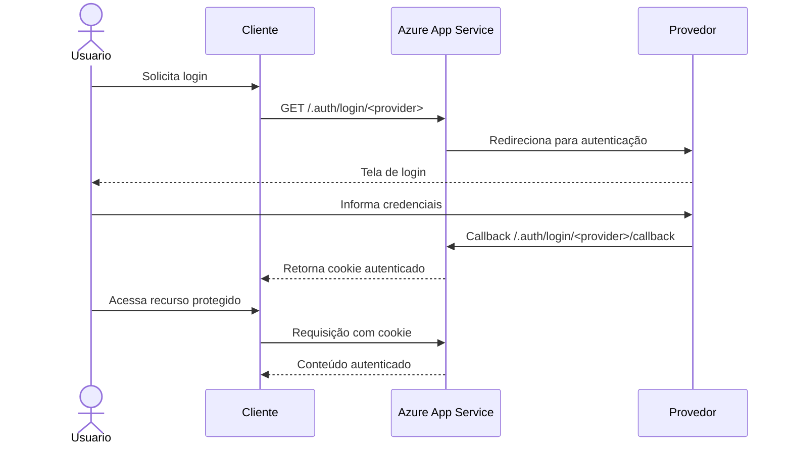

O Serviço de Aplicativo é uma forma de utilizar computação em nuvem para hospedar aplicações. Muitas empresas optam por migrar aplicações web para a nuvem por causa de vantagens como **escalabilidade**, **alta disponibilidade** e pela redução da necessidade de gerenciar infraestrutura e hardware.

---

# Serviço de Aplicativo do Azure

No Azure, é possível criar aplicações utilizando diferentes tecnologias, como **.NET, [[Java]] (Java SE, Tomcat e JBoss), Node.js, Python e PHP**. Também é possível realizar implantações tanto em **Windows** quanto em **Linux**.

Caso a aplicação utilize contêineres, o Serviço de Aplicativo permite implantar contêineres personalizados, oferecendo maior controle sobre o ambiente de execução.

O Azure também possui integração nativa para implantação contínua (CI/CD), permitindo publicar aplicações diretamente por meio do **Azure DevOps Services, GitHub, Bitbucket, [[FTP]]** ou até mesmo um **repositório Git local**.

## Slots de implantação

Uma funcionalidade interessante é o uso dos **Slots de Implantação**. Em vez de publicar diretamente no ambiente de produção, posso implantar a aplicação em um slot separado para realizar testes antes da troca.

Essa funcionalidade está disponível a partir do plano **Standard** do Serviço de Aplicativo.

Os slots possuem seus próprios nomes de host e permitem trocar tanto o conteúdo quanto as configurações entre os ambientes sem necessidade de uma nova implantação. Mais detalhes em [[Implementation Slot]].

## Kudu

O Serviço de Aplicativo utiliza o **Kudu** para realizar implantações baseadas em Git e arquivos ZIP.

Pelo que entendi, o Kudu é responsável por sincronizar os arquivos da aplicação e executar os processos necessários durante a implantação.

Mais informações em [[Apache Kudu]].

## Contêiner Sidecar

Também é possível adicionar um contêiner **Sidecar** utilizando o **Centro de Implantação** na página de gerenciamento da aplicação.

---

# Fluxo de autenticação

O fluxo de autenticação pode funcionar de duas maneiras: utilizando diretamente o SDK do provedor de identidade ou deixando que o próprio Serviço de Aplicativo gerencie a autenticação.
Abaixo um diagrama de sequencia para ilustrar o fluxo da autenticação:

---

# Dimensionamento automático (Autoscale)

O dimensionamento automático é um mecanismo da computação em nuvem que ajusta automaticamente a quantidade de recursos disponíveis conforme a demanda da aplicação.

Pelo que entendi, esse processo realiza **escalabilidade horizontal**, adicionando ou removendo instâncias da aplicação, em vez de aumentar ou diminuir os recursos de uma única máquina (**escalabilidade vertical**). Mais detalhes em [[Escalabilidade]].

No Azure, o dimensionamento automático é configurado no **Plano do Serviço de Aplicativo**.

É possível definir um número mínimo e máximo de instâncias para os aplicativos hospedados nesse plano. Conforme o tráfego HTTP aumenta, o Azure monitora a carga e cria novas instâncias automaticamente.

Se vários aplicativos estiverem utilizando o mesmo Plano do Serviço de Aplicativo, os recursos desse plano poderão ser compartilhados durante o processo de escalabilidade horizontal.

### Referencias

Microsoft Learn. **Caminho da carreira do desenvolvedor.** Disponível em: https://learn.microsoft.com/pt-br/plans/prq5a8d0egog4j